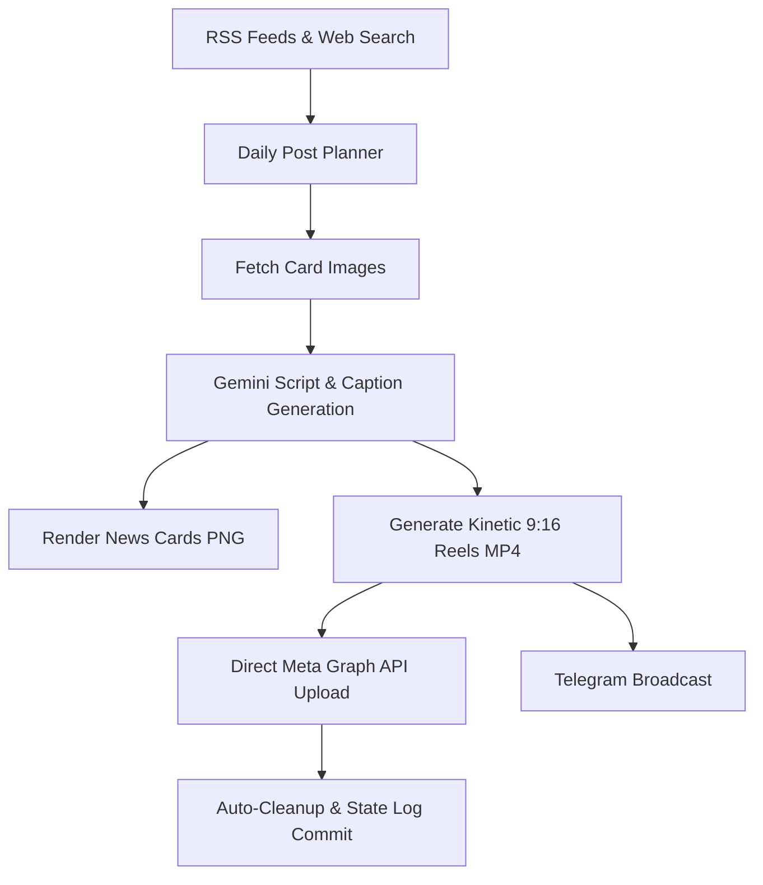

# Instagram Reels & Cards Automation Pipeline 🚀

An autonomous, AI-driven pipeline that curates Defence, Geopolitics, and SSB preparation topics, synthesizes spoken video scripts, renders kinetic 9:16 vertical video Reels with neural voiceovers & synchronized glowing subtitles, builds visual cards, and publishes them automatically to **Instagram** and **Telegram**.

---

## 🌟 Key Features

- **Automated Topic & News Fetching**: RSS feeds & DDG web search for latest defence developments and rotational SSB preparation topics.
- **AI Content Synthesis**: Generates engaging spoken narration scripts, Instagram captions, and visual layouts via Google Gemini.
- **AI Kinetic Reels (1080×1920)**: Ken Burns motion background + Neural Voiceover (`edge-tts`) + Dynamic ASS Subtitles burned via FFmpeg.
- **Dual Visual Post Cards (1080×1080)**: High-resolution PNG cards with Puppeteer screenshot rendering.
- **Direct Instagram Publishing**: Resumable binary upload to Meta Graph API for Instagram Reels + anti-spam 5-minute staggering.
- **Telegram Channel Integration**: Instant cross-posting of all generated video reels to Telegram.
- **Full CI/CD Automation**: Scheduled daily automation via GitHub Actions with automatic state & deduplication log sync.

---

## 📊 Pipeline Overview



### Daily Post Outputs

| Post | Type | Video (9:16) | Card (1:1) | Interval |
|------|------|--------------|------------|----------|
| **1** | News Reel | `reel_1.mp4` | `instagram-newscard_1.png` | Immediate |
| **2** | News Reel | `reel_2.mp4` | `instagram-newscard_2.png` | +5 mins |
| **3** | News Reel | `reel_3.mp4` | `instagram-newscard_3.png` | +5 mins |
| **4** | SSB Prep Reel | `reel_4.mp4` | `instagram-ssbcard_4.png` | +5 mins |

---

## 🛠️ Local Quick Start

### 1. Prerequisites
- Python 3.10+
- Node.js 18+ & npm
- FFmpeg (added to system PATH)

### 2. Installation
```bash
git clone https://github.com/Prashant8008/insta_automation.git
cd insta_automation

# Install Python dependencies
pip install -r requirements.txt

# Install Node dependencies & Puppeteer browser
npm install
npx puppeteer browsers install chrome
```

### 3. Environment Variables (`.env`)
Create a `.env` file in the root directory:
```env
# Google Gemini API
GEMINI_API_KEY=your_gemini_api_key

# Meta / Instagram Graph API
FACEBOOK_ACCESS_TOKEN=your_facebook_user_or_page_access_token
INSTAGRAM_BUSINESS_ACCOUNT_ID=your_instagram_business_account_id
DRY_RUN=false

# Telegram Bot (Optional for cross-posting)
TELEGRAM_BOT_TOKEN=your_telegram_bot_token
TELEGRAM_CHAT_ID=your_telegram_chat_id

# AI Voice Configuration
REEL_VOICE=en-IN-NeerjaExpressiveNeural
```

### 4. Running the Pipeline
```bash
# Complete workflow: Generate Reels + Post immediately with 5-minute interval
python run_instagram_pipeline.py

# Generate only (testing Reels & Cards locally without posting)
python run_instagram_pipeline.py --generate

# Render standalone test reel
python generate_news_reel.py --sample
```

---

## ⚡ GitHub Actions CI/CD Setup

The repository includes a ready-to-run GitHub Actions workflow (`.github/workflows/instagram_daily_pipeline.yml`) configured for automated daily execution.

### Scheduled Cron Triggers
- **Morning Batch**: `02:00 UTC` (7:30 AM IST)
- **Evening Batch**: `13:00 UTC` (6:30 PM IST)
- **Manual Trigger**: Via GitHub Actions `workflow_dispatch` button

### Required GitHub Repository Secrets

Go to **Settings > Secrets and variables > Actions > New repository secret** and add:

| Secret Name | Description |
|-------------|-------------|
| `GEMINI_API_KEY` | Google Gemini API key for script & caption generation |
| `FACEBOOK_ACCESS_TOKEN` | Meta Graph API access token with `instagram_basic`, `instagram_content_publish` permissions |
| `INSTAGRAM_BUSINESS_ACCOUNT_ID` | Your Instagram Business or Creator Account ID |
| `TELEGRAM_BOT_TOKEN` | Telegram bot token from @BotFather |
| `TELEGRAM_CHAT_ID` | Telegram channel or group chat ID |
| `DRY_RUN` *(Optional)* | Set to `'true'` to test execution without live publishing |

---

## 📁 Repository Structure

```
├── .github/workflows/
│   └── instagram_daily_pipeline.yml  # GitHub Actions cron & manual workflow
├── assets/                           # Brand assets and graphics
├── brand_utils.py                    # Brand style filters and text sanitizers
├── build_instagram_visuals.cjs       # Puppeteer script for card PNG screenshots
├── cleanup_pipeline.py               # Auto-cleaner for intermediate build files
├── create_reel_overlay.py            # PIL script for 1080x1920 video overlays
├── fetch_ai_news_rss.py              # Defence & geopolitical RSS aggregator
├── fetch_card_images.py              # High-res og:image background downloader
├── generate_instagram_posts.py       # Gemini prompt engine for reels narration & captions
├── generate_news_reel.py             # FFmpeg + Edge-TTS kinetic video renderer
├── plan_daily_posts.py               # Post selection & SSB topic rotator
├── publish_to_instagram.py           # Meta Graph API resumable reel uploader
├── publish_to_telegram.py            # Telegram video reel broadcast dispatcher
├── run_instagram_pipeline.py         # Master pipeline orchestrator
├── requirements.txt                  # Python dependencies
└── package.json                      # Node dependencies
```

---

## 🔒 Deduplication & History

The pipeline tracks previously published headlines and rotated topics in `news-card-log.json`, `ssb-topic-log.json`, and `ai_news_data.json`. The GitHub Actions workflow commits these files back to the repository on each run to prevent duplicate posts across runs.

